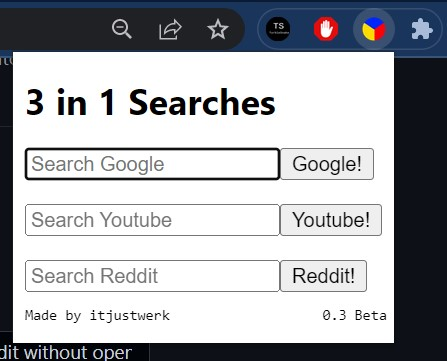
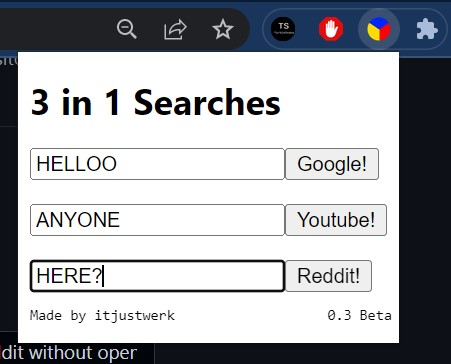

# 3-in-1-Searches     
3 in 1 Searches is a useful Chrome extension that lets you search on Youtube, Google and Reddit without opening a New Tab or changing the current tab.

## Install instructions:
  **Manual install:**
  1. Unzip the content folder
  2. Go to chrome://extensions in your browser.
  3. Enable Developer mode.
  4. Click Load Unpacked and choose the "3in1 Searches" folder.

